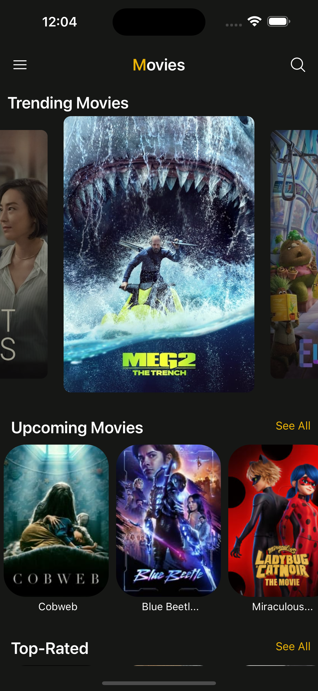
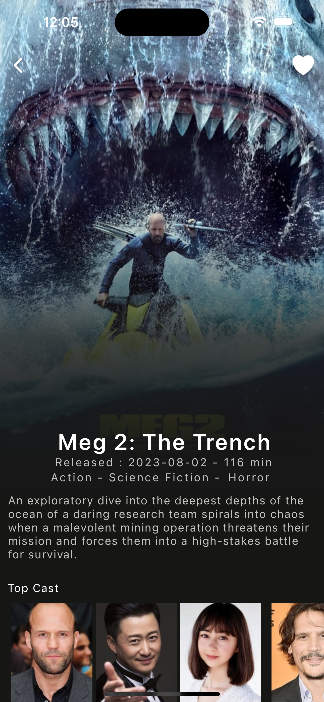
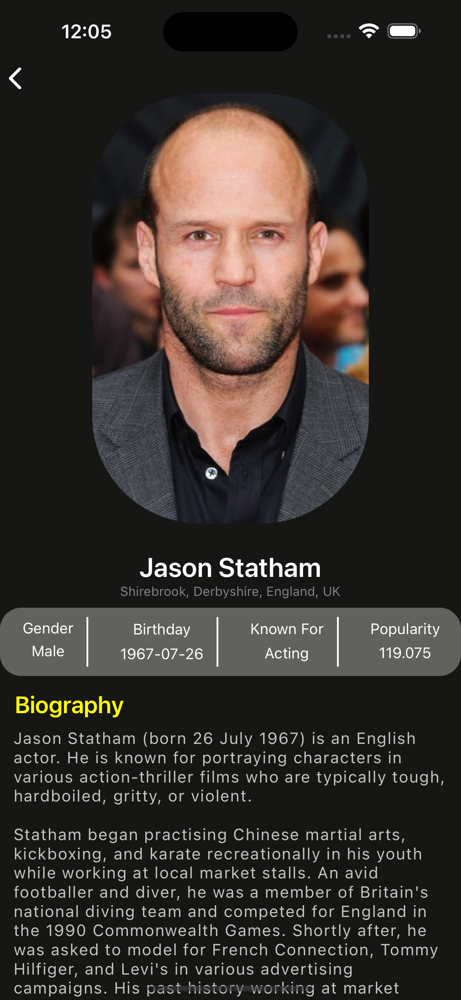
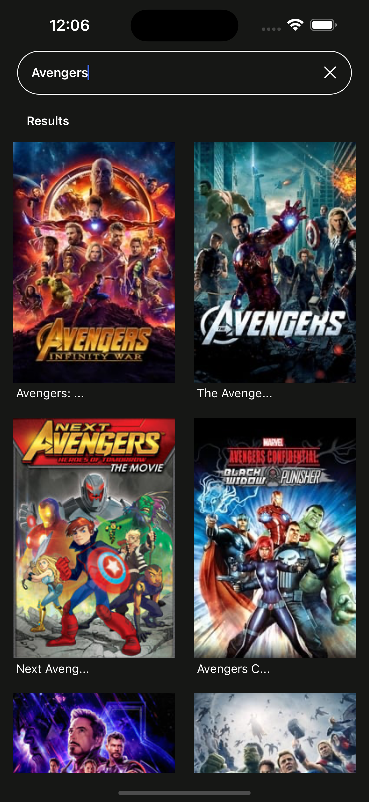

# Movie Application with React Native

The application involved the usage of react native via Expo CLI and the TMDB API servive to make API calls relevant to the mobile app.

## Library Installation

The command below is executed to install the required libraries.

```js
    npm i
```

## To Run The Application

The command below is the initiate the application.

```js
    npm start
```

## Application User Interface
<div>
    
    
    
    
</div>

### Application Demo
https://github.com/amira-azeer/React-Native-Movie-App/assets/103902057/23e4ff5a-df78-4d2a-8c3b-796de27bb655

